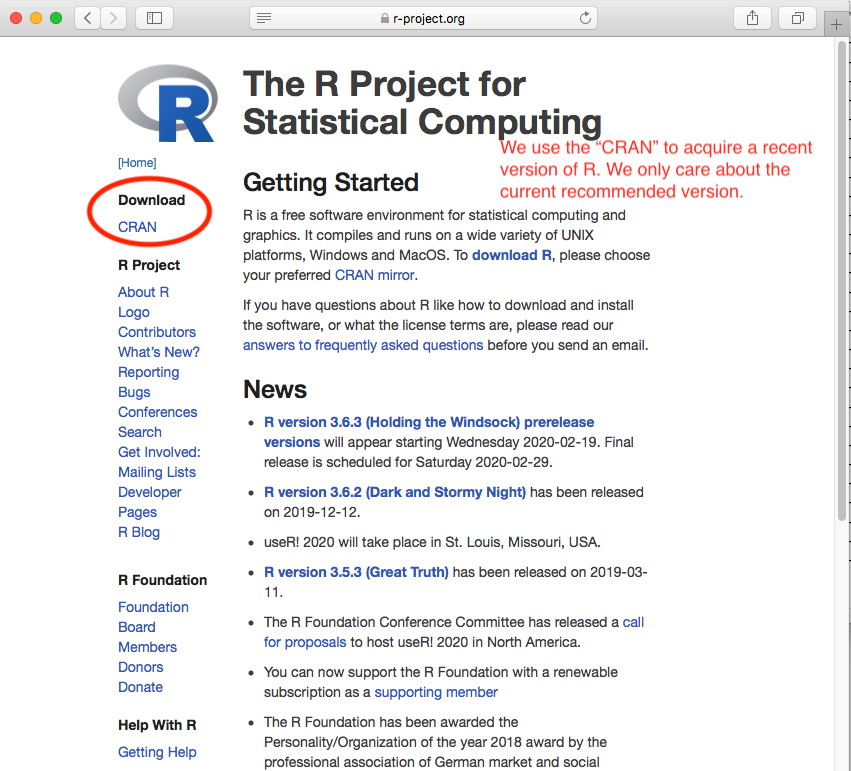
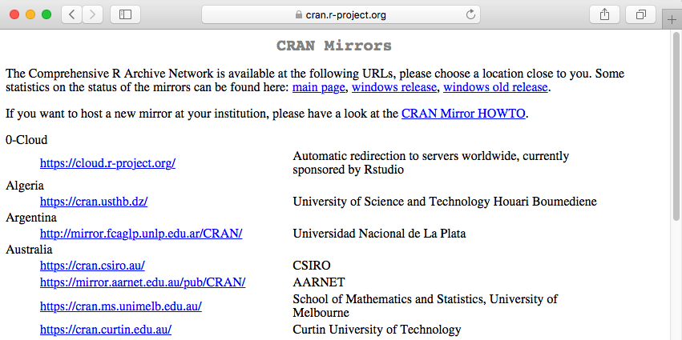
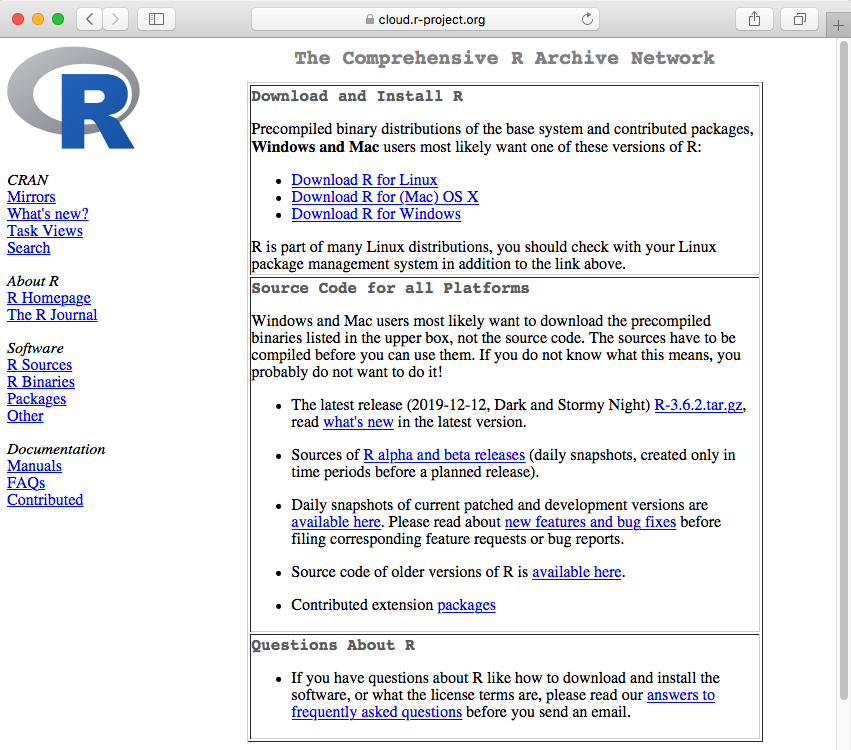
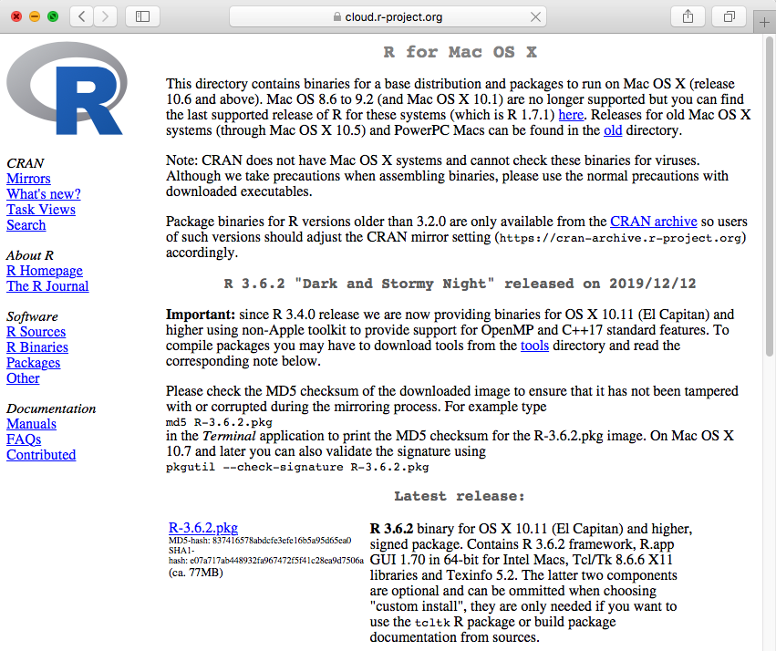
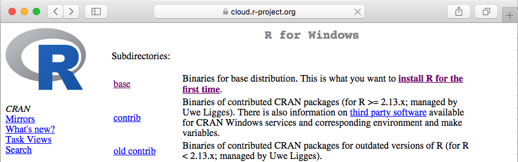
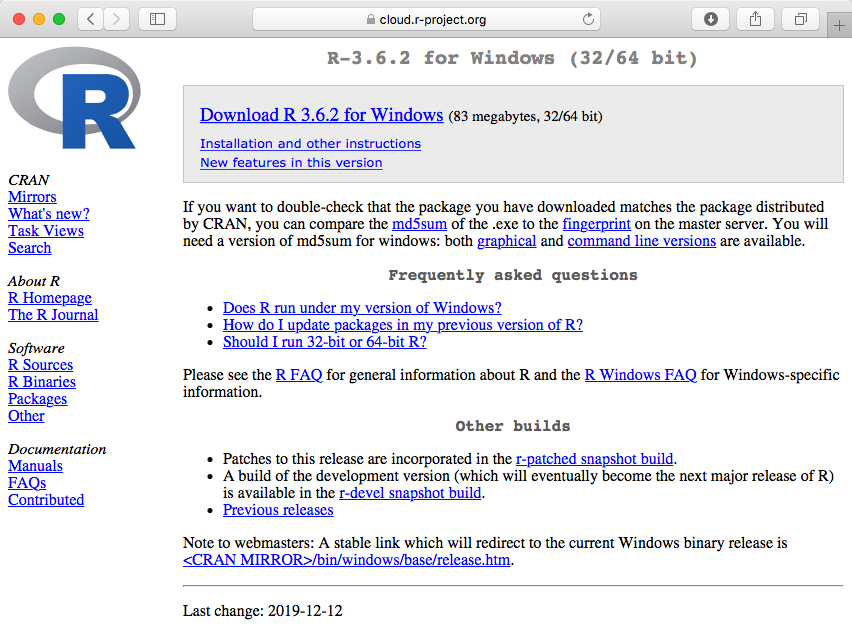
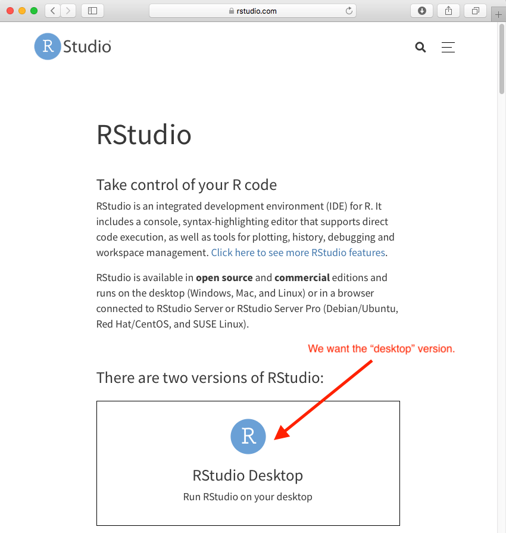
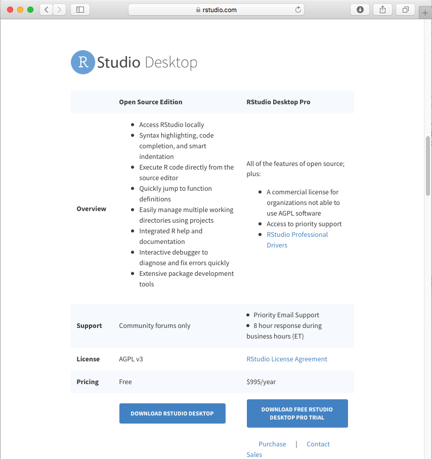
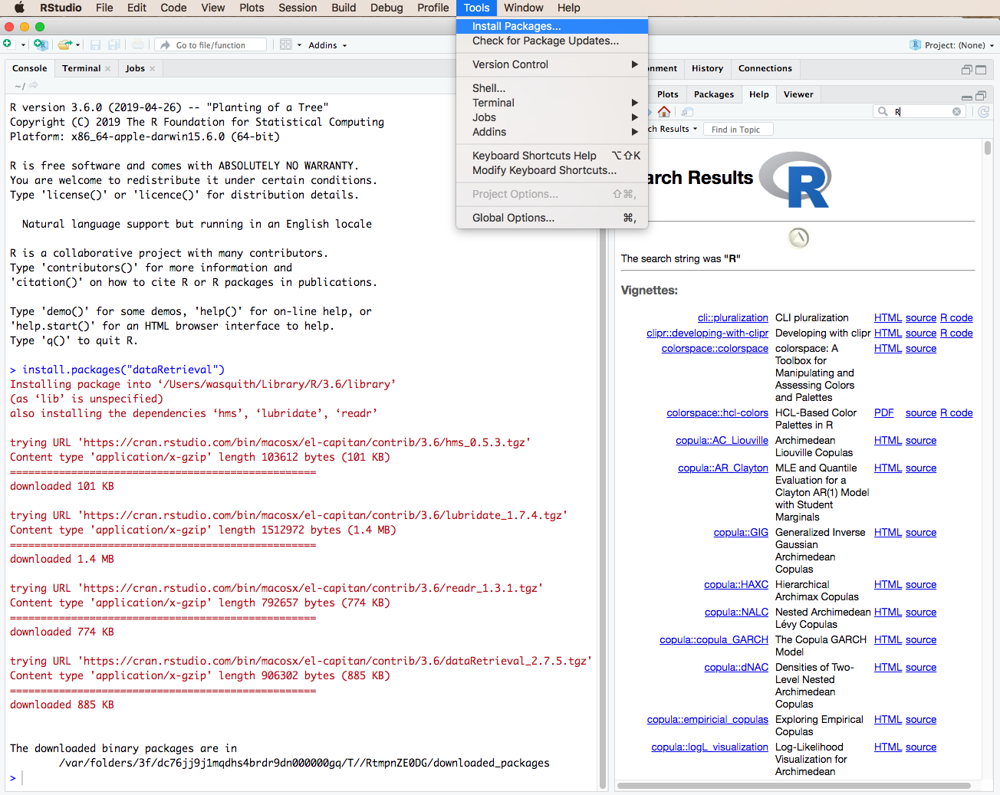
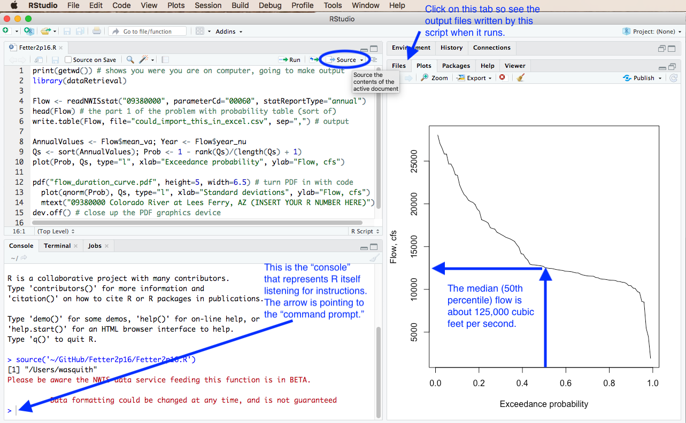

# Fetter Problem 2.16 (Flow-Duration Curve)

#### Author:           William H. Asquith

***
***

# DESCRIPTION

The annual flow of the U.S. Geological Survey (USGS) streamflow-gaging station (streamgage) 09380000 Colorado River a Lees Ferry, Arizona can be acquired from the Internet. The current conditions for the streamgage can be found at https://waterdata.usgs.gov/usa/nwis/uv?09380000.

Following the problem 2.16 in Fetter (2001, p.64), we are asked to

1. Construct a table of probability values, and

2. Plot a flow-duration curve showing the percent of the time an indicated discharge (streamflow) was equaled or exceeded using standard probability paper. Well, we do not have such "paper" but we can hack some together using _R_.

For the solution to the problem, we will use the **dataRetrieval** package to acquire the USGS streamflow data so that we do not have to enter such data by hand. However, we need first to install _R_ and the recommended _RStudio_ interface. This README first helps us get the requisite systems running on the computer and then will lead us through the solution of problem 2.16. This FDC problem then provides a great opportunity to jump right into the power of using a scripting language for data science in water resources.

# Installing _R_

**STEP 1: Navigate to the R Project Home Page and Locate the CRAN link**



***

**STEP 2: Choose a Mirror of the CRAN**



***

**STEP 3: What the CRAN Looks Like to Reach Installers and Packages**



***

**STEP 4a: Installation for MACOS**



***

**STEP 4b: Installation for Windows**



***



***

# Installing _RStudio_

**STEP 1: Navigate to the R Studio Home Page and Location the Menus Button**


***

**STEP 2: Proceed through Several Windows to Get to the RStudio Free-Desktop Version**



***



***


# POST INSTALLATION INSTRUCTIONS





# FETTER PROBLEM 2.16

The following "commands" can be typed at the console prompt in _R_ to solve the problem. However, the author usually opens a new script from the `File` menu and would paste the commands shown below in one large chunk and run the code. We will use both styles in class.

```{r}
  print(getwd()) # shows you were you are on computer, going to make output
  library(dataRetrieval)
```

```
  Flow <- readNWISstat("09380000",parameterCd="00060",statReportType="annual")
  head(Flow) # the part 1 of the problem with probability table (sort of)
  write.table(Flow, file="could_import_this_in_excel.csv", sep=",") # output
```

```
  AnnualValues <- Flow$mean_va; Year <- Flow$year_nu
  Qs <- sort(AnnualValues); Prob <- 1 - rank(Qs)/(length(Qs) + 1)
  plot(Prob, Qs, type="l", xlab="Exceedance probability", ylab="Flow, cfs")
```

```
  pdf("flow_duration_curve.pdf", height=5, width=6.5) # turn PDF in with code
    plot(qnorm(Prob), Qs, type="l", xlab="Standard deviations", ylab="Flow, cfs")
    mtext("09380000 Colorado River at Lees Ferry, AZ (INSERT YOUR R NUMBER HERE)")
  dev.off() # close up the PDF graphics device
```

A lower case "L" is the `type="l"` in relation to the `plot()` function to make it a line plot. It is not the number "1". The `qnorm()` function turns probability into standard deviations from the mean, but the axis is distorted in the same way as Fetter's probability paper on p. 65 of the book. If you want to access the _R_ help, use > `?qnorm` if you want to look up a topic use > `??"standard deviation"`

## What does the Authors' _RStudio_ Session Look Like?

The author has saved all of the aforementioned commands or code in the file `Fetter2p16.R` that resides in this repository. That script is open in the screenshot of _RStudio_ shown below. Along the results shown on the plot that were generated by running the commands using the "Source" button that is encircled near the top of the screen. Additional annotation is present to help familiarize the user, and additional discussion in class concerning the plot and other things can be made.




## How Do I Learn More about R?

We have actually worked an exceptionally common problem in the science of surface water hydrology.  The lesson here is supposed to be used an introduction to using _R_ in an advanced problem and not as a tutorial into the language itself. Sometimes the first leap into something new requires the creation of foundational understanding and workflow and then the self learning can commence.

There are various "cheat sheets" into _R_ and _RStudio_. Your author extensively used this [Short-refcard](https://cran.r-project.org/doc/contrib/Short-refcard.pdf)
 some 20 years ago during initial learning of the language. A couple of other reference cards found nearly instantly on the Internet are [here](http://web.mit.edu/hackl/www/lab/turkshop/slides/r-cheatsheet.pdf)
 and [here](http://www.datasciencefree.com/basicR.pdf).

The author is a user of _RStudio_. The author is not perhaps a "power" user and does not use all the features as summarized in this cheatsheet: [RStudio Cheatsheet](https://rstudio.com/wp-content/uploads/2019/01/Cheatsheets_2019.pdf).

## A Good Text Editor is Always Useful

For MacOS, the author uses `BBedit` and `TextWrangler`. The author uses `BBedit` on almost all his Macs in order to support the company ([Bare Bones Software](http://www.barebones.com)). Windows users are encouraged to get `NotePad++` from [notepad-plus-plus.org](https://notepad-plus-plus.org).


# REFERENCES

Fetter, C.W., 2001 Applied hydrogeology, 4th ed.: Prentice-Hall, ISBN 0-13-088239-9.
