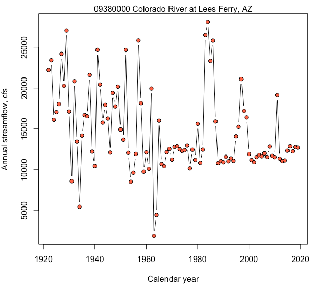

# Fetter Problem 2.16 (Flow-Duration Curve)

#### Author:           William H. Asquith

***
***

# DESCRIPTION

The annual flow of the U.S. Geological Survey (USGS) streamflow-gaging station (streamgage) 09380000 Colorado River a Lees Ferry, Arizona can be acquired from the Internet. The current conditions for the streamgage can be found at https://waterdata.usgs.gov/usa/nwis/uv?09380000.

Following the problem 2.16 in Fetter (2001, p.64), we are asked to

1. Construct a table of probability values, and

2. Plot a flow-duration curve showing the percent of the time an indicated discharge (streamflow) was equaled or exceeded using standard probability paper. Well, we do not have such "paper" but we can hack some together using _R_.

For the solution to the problem, we will use the **dataRetrieval** package to acquire the USGS streamflow data so that we do not have to enter such data by hand. However, we need first to install _R_ and the recommended _RStudio_ interface. This README first helps us get the requisite systems running on the computer and then will lead us through the solution of problem 2.16. This FDC problem then provides a great opportunity to jump right into the power of using a scripting language for data science in water resources.

# Installing _R_

**STEP 1: Navigate to the R Project Home Page and Locate the CRAN link**


***

**STEP 2: Choose a Mirror of the CRAN**


***

**STEP 3: What the CRAN Looks Like to Reach Installers and Packages**


***

**STEP 4a: Installation for MACOS**


***

**STEP 4b: Installation for Windows**


***


***

# Installing _RStudio_

**STEP 1: Navigate to the R Studio Home Page and Location the Menus Button**


***

**STEP 2: Proceed through Several Windows to Get to the RStudio Free-Desktop Version**


***


***


# POST INSTALLATION INSTRUCTIONS


# FETTER PROBLEM 2.16

## First a "Hello World" Problem

At the command console, type `print("Hello World")`. You will see this `[1] "Hello World"` returned within the console. Congratulations, you have written your first _R_ program. Let us now run a few small operations to give you a feel by moving into a prompt `>` and answer style.

How about the cosine of 45 degrees?

```
> cos(pi/4)
[1] 0.7071068
```

The prompt though gets in the way of copy and paste. So the author prefers to write operations and returned content this way. How about a sequence even numbers divided by 3?

```
seq(2:10,by=2)/3
# [1] 0.6666667 1.3333333 2.0000000 2.6666667 3.3333333
```

But this time, the author has added the `#` sign, which is a harmless comment command that tells _R_ to ignore the rest of the line. This is done so one can copy and paste everything above "by accident" and not have _R_ complain that `[1] 0.6666667 1.3333333 2.0000000 2.6666667 3.3333333` is not actually a command. This is just stylistically a style chosen by the author.

Let us work another. We have the basic mathematical features available as the following example shows with the `c()` operation being uses to concatenate the number 1, 6, 8, and 9 in to a vector. In fact, in _R_ basically everything is a vector. So the system is "vectorized", which is incredibly powerful in practical applications. The code below hints that _R_ is usually very forgiving on placement of spaces.

```
  (c(1, 6,8,  9) + 5) *    2
# [1] 12 22 26 28
```


## Solving Fetter 2.16

The following "commands" can be typed at the console prompt in _R_ to solve the problem. However, the author usually opens a new script from the `File` menu and would paste the commands shown below in one large chunk and run the code. We will use both styles in class. There is a lot of functionality in the short lines of code to follow.

It is important to understand where input to or output files from _R_ are occurring. A chronic challenge in working with young scientists in the "modern computer age" is where files are stored and organized. This does not matter too much to a student, but to an employeer on real projects this matters for all. Notice in the code that follows that the author had threaded comments into the code.

```{r}
  print(getwd()) # shows you were you are on computer, going to make output
  getwd() # the effect is the same but depending on how the code was fed, the print
  # might be needed.
```

We need the **dataRetrieval** package, which is not shipped with base _R_. The installation instructions above have assumed that this package has been installed. We load the library's functionality into the current work session by the following command. There are perhaps 20,000+ _R_ packages circulating the global for various needs. Just on the central [CRAN](https://cran.r-project.org) there are, as of February 17, 2020, some 15,402 packages are present.

```{r}
  library(dataRetrieval)
```

We now seek the annual streamflow statistics for the 09380000 streamgage. The quotation marks and leading zero are mandatory.  The parameter code for discharge (flow) for the USGS National Water Information System (NWIS) is `00060` and the statistic that we desire are annual mean streamflow values. The `readNWISstat()` function goes to the Internet to get the data. The function uses named arguments (_e.g._ `parameterCd`) to change its operation. These are comma separated and the spaces are unimportant and two spaces have been deliberately inserted ahead of `statReportType` to prove the point. The `<-` is known as the "assignment operator" and assigns the results of the operations on the right to the object on the left (`Flow`).

```
  Flow <- readNWISstat("09380000", parameterCd="00060",  statReportType="annual")
```

The variable `Flow` is a "data frame," which is one of the fundamental data types in _R_. It conceptually is a "spreadsheet" in structure and layout that students are familiar with. Let us have a look at the first few rows in this table using the `head()` function. Then we can write this table to the file system as a comma-separated file and import that into a spreadsheet; however, spreadsheets are severely limiting, we will stay in _R_.


```
  head(Flow) # the part 1 of the problem with probability table (sort of)
  write.table(Flow, file="could_import_this_in_excel.csv", sep=",") # output
```

Our analysis can finally begin. We have the data and a purpose. In the code below, we extract the annual streamflow from the column named `mean_va` from the `Flow` table and save into the variable `AnnualValues`. The same is does for the calendar year. (We know it is calendar year because the `?readNWISstat` documentation tells us so as hopefully remembered to demo.) The code also contains the ordering (sorting) of the streamflows into another variables `Qs` and on the same line (note the semicolon `;`) the probabilities (not percentages because multiplication by 100 is not present) are computed by the ranking and the computation `i/(n+1)` as Fetter shows us in the text. The code has also moved to empty lines to show that we can break up the commands for more readability. Readability of code is big deal and experienced technical mentors look for this from young scientists. The code ends with our first plotting operation using the `plot()` function with just a few named arguments to enhance the appearance.

```
  AnnualValues <- Flow$mean_va   # extract the flows
  Year         <- Flow$year_nu   # extract the calendar years

  Qs <- sort(AnnualValues); Prob <- 1 - rank(Qs)/(length(Qs) + 1)

  plot(Prob, Qs, type="l", xlab="Exceedance probability", ylab="Flow, cfs")
```

In the previous code, a lower case "L" is the `type="l"` in relation to the `plot()` function to make it a line plot. It is not the number "1". During the code development cycle, we often want to inspect the contents of variables. We can do that through the _RStudio_ interface with the "Environment" tab, but the author almost exclusively just types a variable name at the prompt. Try typing `Qs` to see all of the streamflows, which shows that 98 years were available.

```
> Qs
 [1]  1911  4468  5454  8515  8589  9623  9752 10100 10160 10440 10450 10690 10810
[14] 10840 10910 10930 11030 11060 11070 11090 11140 11180 11200 11240 11360 11390
[27] 11540 11550 11560 11580 11640 11690 11790 11920 11930 11990 12060 12090 12110
[40] 12130 12210 12240 12280 12320 12380 12440 12450 12490 12540 12700 12760 12790
[53] 12830 12860 12870 12950 13440 13680 14100 14180 14920 15240 15610 15760 15900
[66] 16000 16100 16260 16400 16550 16680 17050 17120 17200 17750 17930 18040 18150
[79] 19130 19400 19940 20170 20270 20430 20840 21100 21600 22200 23330 23410 24190
[92] 24660 24670 25820 25830 26500 27060 28070
```

To complete the request of problem 2.16 to construct the flow-duration curve on "probability paper," which we can hack together using a transform on the probabilities in to "standard normal variates" from the Normal (bell-shaped) probability distribution using the `qnorm()` function. The code that follows does this along with creation of a PDF file of the graphic on the file system. This file could then be printed out or emailed to a colleague. The author would like your student "R" number inserted as shown and the plot turned in with your name and date on the top of the page.

```
  pdf("flow_duration_curve.pdf", height=5, width=6.5) # turn PDF in with code
    plot(qnorm(Prob), Qs, type="l", xlab="Standard deviations", ylab="Flow, cfs")
    mtext("09380000 Colorado River at Lees Ferry, AZ (INSERT YOUR R NUMBER HERE)")
  dev.off() # close up the PDF graphics device
```

The `qnorm()` function turns probability into standard deviations from the mean, but the axis is distorted in the same way as Fetter's probability paper on p. 65 of the book. If you want to access the _R_ help, use > `?qnorm` if you want to look up a topic use `??"standard deviation"`.

That is it. We have created a flow-duration curve. It is perhaps useful to conclude the problem with an extra step of plotting a time series of the data. Notice that we can continue "long" functions around the end of the line and that the author aligns `xlab` under `type` only because it looks good, is more readable. Discussion of this figure along with the flow-duration will elucidate much of the hydrologic history of the Colorado River at Lees Ferry.

```
  plot(Year, AnnualValues, type="b", pch=21, bg="tomato",
                           xlab="Calendar year", ylab="Annual streamflow, cfs")
  mtext("09380000 Colorado River at Lees Ferry, AZ")
```




## What does the Author's _RStudio_ Session Look Like?

The author has saved all of the aforementioned commands or code in the file `Fetter2p16.R` that resides in this repository. That script is open in the screenshot of _RStudio_ shown below. Along the results shown on the plot that were generated by running the commands using the "Source" button that is encircled near the top of the screen. Additional annotation is present to help familiarize the user, and additional discussion in class concerning the plot and other things can be made.


## How Do I Learn More about R?

We have actually worked an exceptionally common problem in the science of surface water hydrology.  The lesson here is supposed to be used an introduction to using _R_ in an advanced problem and not as a tutorial into the language itself. Sometimes the first leap into something new requires the creation of foundational understanding and workflow and then the self learning can commence.

There are various "cheat sheets" into _R_ and _RStudio_. Your author extensively used this [Short-refcard](https://cran.r-project.org/doc/contrib/Short-refcard.pdf)
 some 20 years ago during initial learning of the language. A couple of other reference cards found nearly instantly on the Internet are [here](http://web.mit.edu/hackl/www/lab/turkshop/slides/r-cheatsheet.pdf)
 and [here](http://www.datasciencefree.com/basicR.pdf).

The author is a user of _RStudio_. The author is not perhaps a "power" user and does not use all the features as summarized in this cheatsheet: [RStudio Cheatsheet](https://rstudio.com/wp-content/uploads/2019/01/Cheatsheets_2019.pdf).

## A Good Text Editor is Always Useful

For MacOS, the author uses `BBedit` and `TextWrangler`. The author uses `BBedit` on almost all his Macs in order to support the company ([Bare Bones Software](http://www.barebones.com)). Windows users are encouraged to get `NotePad++` from [notepad-plus-plus.org](https://notepad-plus-plus.org).


# REFERENCES

Fetter, C.W., 2001 Applied hydrogeology, 4th ed.: Prentice-Hall, ISBN 0-13-088239-9.
