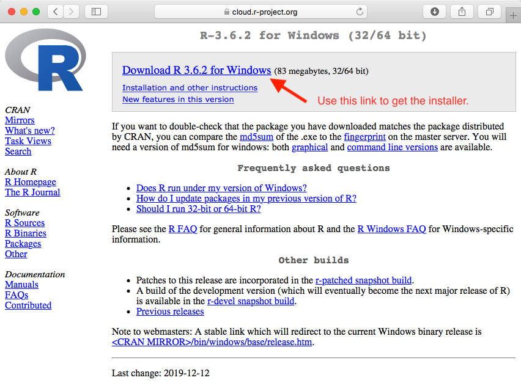
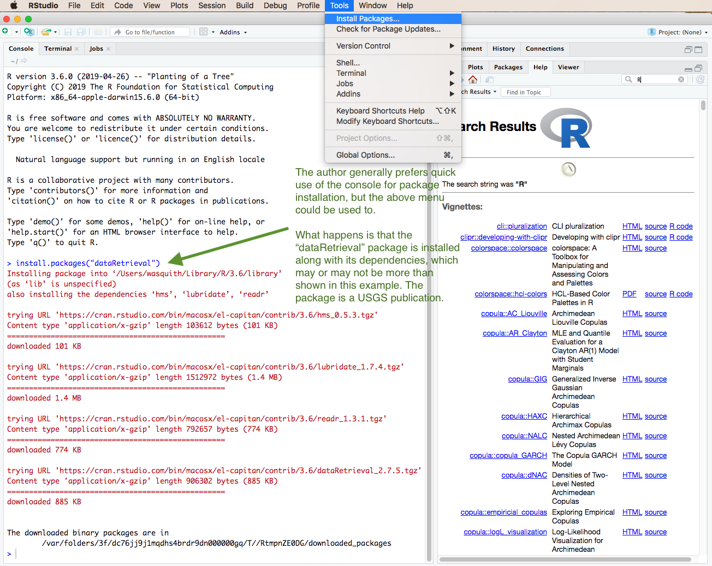

# Fetter Problem 2.16 (Flow-Duration Curve)

#### Author:           William H. Asquith

***
***

# DESCRIPTION

The annual flow of the U.S. Geological Survey (USGS) streamflow-gaging station (streamgage) 09380000 Colorado River a Lees Ferry, Arizona can be acquired from the Internet. The current conditions for the streamgage can be found at https://waterdata.usgs.gov/usa/nwis/uv?09380000.

Following the problem 2.16 in Fetter (2001, p.64), we are asked to

1. Construct a table of probability values, and

2. Plot a flow-duration curve showing the percent of the time an indicated discharge (streamflow) was equaled or exceeded using standard probability paper. Well, we do not have such "paper" but we can hack some together using _R_.

For the solution to the problem, we will use the **dataRetrieval** package to acquire the USGS streamflow data so that we do not have to enter such data by hand. However, we need first to install _R_ and the recommended _RStudio_ interface. This README first helps us get the requisite systems running on the computer and then will lead us through the solution of problem 2.16. This FDC problem then provides a great opportunity to jump right into the power of using a scripting language for data science in water resources.

# Installing _R_

**STEP 1: Navigate to the R Project Home Page and Locate the CRAN link**


***

**STEP 2: Choose a Mirror of the CRAN**


***

**STEP 3: What the CRAN Looks Like to Reach Installers and Packages**


***

**STEP 4a: Installation for MACOS**


***

**STEP 4b: Installation for Windows**


***



***

# Installing _RStudio_

**STEP 1: Navigate to the R Studio Home Page and Location the Menus Button**


***

**STEP 2: Proceed through Several Windows to Get to the RStudio Free-Desktop Version**


***


***


# POST INSTALLATION INSTRUCTIONS





# FETTER PROBLEM 2.16

```{r}
  print(getwd()) # shows you were you are on computer, going to make output
  library(dataRetrieval)
```

```
  Flow <- readNWISstat("09380000",parameterCd="00060",statReportType="annual")
  head(Flow) # Satisfies Fetter's (A) request (sort of)
  write.table(Flow, file="could_import_this_in_excel.csv", sep=",") # output
```

```
  AnnualValues <- Flow$mean_va; Year <- Flow$year_nu
  Qs <- sort(AnnualValues); Prob <- 1 - rank(Qs)/(length(Qs) + 1)
  plot(Prob, Qs, type="l", xlab="Exceedance probability", ylab="Flow, cfs")
```

```
  pdf("flow_duration_curve.pdf", height=5, width=6.5) # turn PDF in with code
    plot(qnorm(Prob), Qs, type="l", xlab="Standard deviations", ylab="Flow, cfs")
    mtext("09380000 Colorado River at Lees Ferry, AZ (INSERT YOUR R NUMBER HERE)")
  dev.off() # close up the PDF graphics device
```


# REFERENCES

Fetter, C.W., 2001 Applied hydrogeology, 4th ed.: Prentice-Hall, ISBN 0-13-088239-9.
