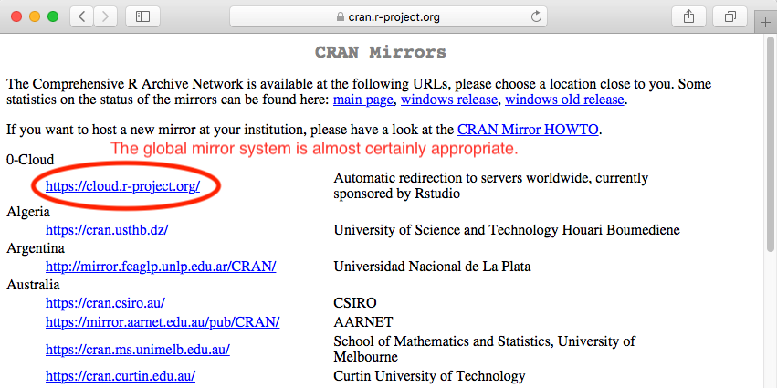

# Fetter Problem 2.16 (Flow-Duration Curve)

#### Author:           William H. Asquith

***
***

# DESCRIPTION

# Installing _R_

**STEP 1: Navigate to the R Project Home Page and Locate the CRAN link**

***

**STEP 2: Choose a Mirror of the CRAN**

***

**STEP 3: What the CRAN Looks Like to Reach Installers and Packages**

***

**STEP 4a: Installation for MACOS**

***

**STEP 4b: Installation for Windows**

***

***

# Installing _RStudio_

**STEP 1: Navigate to the R Studio Home Page and Location the Menus Button**

***

**STEP 2: Proceed through Several Windows to Get to the RStudio Free-Desktop Version**

***

***

# POST INSTALLATION INSTRUCTIONS

# FETTER PROBLEM 2.16

# REFERENCES
